# Themisto

Hola! Themisto es una app en node.js que utiliza el modulo **Puppeteer** para realizar simulacion y abstraccion de datos en paginas web (web scraping) con fines educativos 👨‍💻📚.

## Puppeteer

Toda la documentacion de puppeteer esta disponible en su sitio oficial y en su propio repositorio que les dejo a continuacion:

-  [Web Site](https://pptr.dev/)
- [Repositorio](https://github.com/puppeteer/puppeteer)

## Funcionamiento

Themisto ingresa a un sitio web y abre un navegador preparado para ser controlado completa mente por codigo, es decir estariamos haciendo una automatizacion de procesos en el navegador. Esto sirve por ejemplo para rotar contraseñas en mas de una cuenta a la vez o publicar varios avisos en varios sitios web de una sola vez. 

    const  puppeteer = require('puppeteer');

Puppeter utiliza mayor mente **async** **await** debido a que debemos tener en cuenta el tiempo en el que el navegador se tarda en realizar ciertas operaciones :

    async () => { 
	    const  browser = await  puppeteer.launch({
	    headless: false,
	    defaultViewport:null
	    });
    
	    const  page = await  browser.newPage();
    }

Un ejemplo de funcionamiento seria que a travez de themisto se programara una secuencia en la cual, se ingresan usuario y contraseña para logearse en varios sitios a la vez :

```mermaid
graph LR
A(Themisto: *ingresa usuario y contraseña) -- datos ingresados --> B[Inicio de secion en app A]
A -- datos ingresados --> C[Inicio de secion en app B]
A --datos ingresados--> D[Inicio de secion en app C]
```

